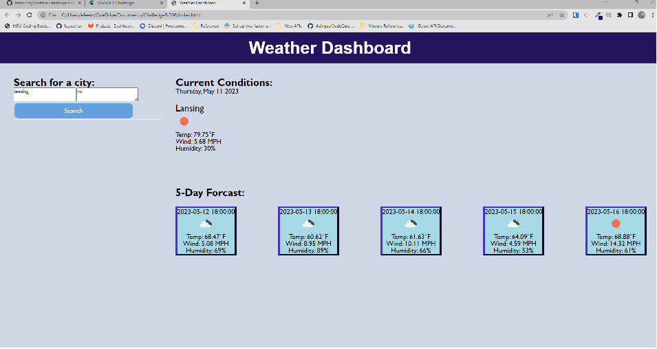

# Weather Dashboard Challenge

## Description

This project involved working with third-party APIs to retrieve data and use in an application. Specifically, the API for this challenge is Openweathermap. Using the data from this API, the task is to build a weather
dashboard that presents current and forecasted weather conditions.

From my standpoint, this is a work in progress as I was able to retrieve and present weather data for current conditions and for a weather forecast. The site uses and dynamically works with html and css. Javascript
provides the functionality for the dashboard. I have also included jQuery and Day.js in the code. Where I am still working is within the saving into local storage and then providing the functionality to display the
weather conditions from search history.

## Usage

I have included a screenshot of the calendar page albeit with the past time color code for all timeblocks.

The project in process can be viewed at [leesochay.github.io/xxx](https://leesochay.github.io/weather-dashboard-challenge/).

## License

MIT License
